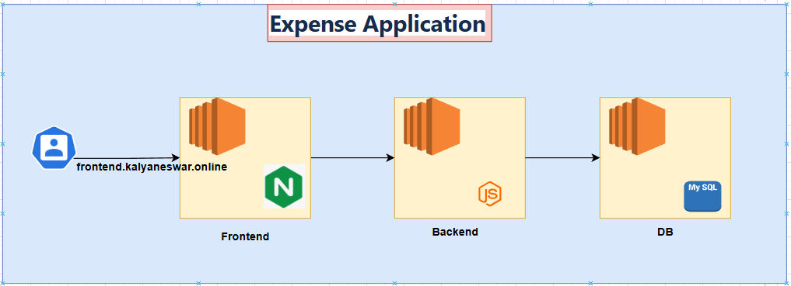

# Expense Application Deployment

This repository contains scripts and configuration files for setting up the Expense application. The application consists of three main components: the frontend (served by Nginx), the backend (Node.js application), and the MySQL database. These components are configured and deployed using bash scripts and system configurations.



## Overview

The deployment process involves setting up the following:

1. **Frontend**: Configured using Nginx, serving static files.
2. **Backend**: A Node.js application, deployed and configured as a service.
3. **Database**: MySQL server setup and schema loading.
4. **Nginx Configuration**: Reverse proxy for API and health checks.
5. **Systemd Service**: Manages the backend Node.js application.

## Prerequisites

- A Linux-based server (e.g., CentOS, RHEL, Amazon Linux).
- Root access to install necessary packages and configure services.
- MySQL root password for configuring the database.
- The backend and frontend application code must be available in an S3 bucket.

## Directory Structure

```
.
├── backend.sh                 # Backend deployment script
├── frontend.sh                # Frontend deployment script
├── db.sh                      # Database deployment script
├── expense.conf               # Nginx configuration for the frontend
├── backend.service            # Systemd service for the backend
└── README.md                  # This file
```

## Deployment Steps

Follow these steps to deploy the full application (frontend, backend, and database).

**1. Database Setup**:
Run the db.sh script to install MySQL, configure the root password, and load the schema.

Run as root
```
sudo bash db.sh
```

This script will:

* Install the MySQL server.
* Enable and start the MySQL service.
* Configure the MySQL root password if not already set.
* Load the database schema from /app/schema/backend.sql.

**2. Backend Setup**
Run the backend.sh script to install Node.js, configure the backend service, and install dependencies.

Run as root
```
sudo bash backend.sh
```

This script will:

- Disable the default Node.js module stream and enable Node.js 20.x.
- Install Node.js and related dependencies.
- Create the expense user (if it does not already exist).
- Download and unzip the backend code to the /app directory.
- Install backend dependencies using npm install.
- Set up the backend as a systemd service.
- Start the backend service and enable it to start on boot.
- Configure the database by running the schema file.

**3. Frontend Setup**
Run the frontend.sh script to install and configure Nginx, then deploy the frontend

Run as root
```
sudo bash frontend.sh
```

This script will:

- Install Nginx.
- Enable and start the Nginx service.
- Download and unzip the frontend code to /usr/share/nginx/html.
- Remove the default Nginx welcome page.
- Configure Nginx to proxy API requests to the backend and serve static files.
- Restart the Nginx service to apply the changes.

**4. Nginx Configuration**
The expense.conf file configures Nginx for the Expense application. It proxies requests to the backend and provides a health check endpoint.

```
proxy_http_version 1.1;

location /api/ {
    proxy_pass http://backend.kalyaneswar.online:8080/;
}

location /health {
    stub_status on;
    access_log off;
}
```

This configuration:

* Proxies requests to /api/ to the backend API.
* Provides a health check at /health.

**5. Systemd Service for Backend**
The backend.service file is used to configure the backend as a systemd service, ensuring it starts automatically on boot.

```
[Unit]
Description = Backend Service

[Service]
User=expense
Environment=DB_HOST="db.kalyaneswar.online"
ExecStart=/bin/node /app/index.js
SyslogIdentifier=backend

[Install]
WantedBy=multi-user.target
```

This configuration:

* Runs the backend service as the expense user.
* Sets the environment variable DB_HOST for the database connection.
* Ensures the backend service starts automatically when the server boots.

**6. Log Files**
The scripts generate log files saved in /tmp with filenames based on the script name and timestamp. Example log file names:

* frontend-<timestamp>.log
* backend-<timestamp>.log
* db-<timestamp>.log
You can review these logs for detailed output during installation and troubleshooting.

## Troubleshooting
**1.MySQL Connection Issues:** Ensure that the MySQL server is running and accessible from the backend. Verify the network settings and MySQL credentials.

**2 Service Failures:** If the backend service fails to start, check the log files (/tmp/backend-<timestamp>.log) for errors related to Node.js or MySQL connectivity.

**3 Nginx Issues:** If the frontend is not loading correctly, verify that Nginx is running and review the Nginx logs (/var/log/nginx/ or the generated script logs).